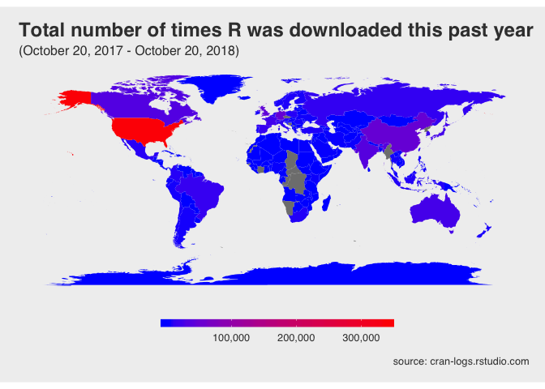
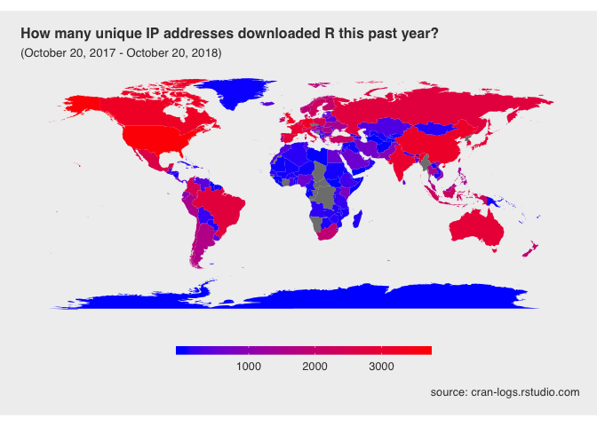
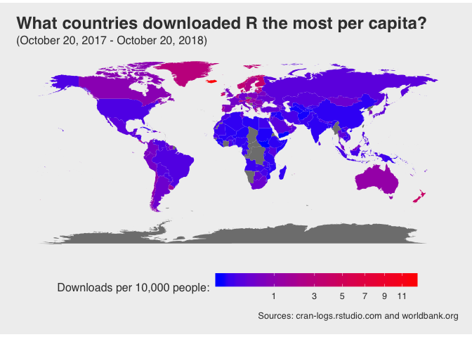
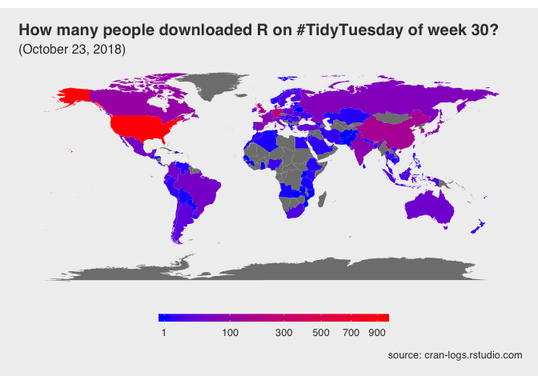

This is the code behind an analysis of the "R and Package download stats" dataset from the [#tidytuesday project](https://github.com/rfordatascience/tidytuesday/tree/master/data/2018-10-30). 

## What countries downloaded R the most this year?

<!-- -->

R was downloaded the most in the US out of all countries. But the above plot counts multiple downloads by the same IP address as separate downloads. Let's look at how many unique IP addresses downloaded R this year.

<!-- -->

Now, the number of people who downloaded R in the US is still the largest in the US, but the difference between the US and other countries is much smaller. The US has a large population compared to other countries though. Let's look at the number of people who downloaded R per capita.

Population data provided by World Development Indicators  (https://data.worldbank.org/indicator/SP.POP.TOTL), last updated 10/18/18.

<!-- -->

Iceland downloaded R far more per capita than any other country. 419 people downloaded R in Iceland, and the population of Iceland is around 341,000. Thus, about 12 people out of every 10,000 in Iceland downloaded R. In comparison, 3,657 people downloaded R in the US, where the population is around 326,000,000. So about 0.1 people in every 10,000, or 1 in every 100,000, downloaded R in the US in the past year.

## What countries downloaded R the most on Tuesday, October 23, 2018 (#tidytuesday week 30)?

<!-- -->

