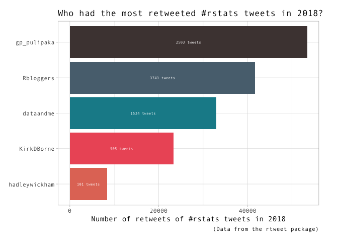
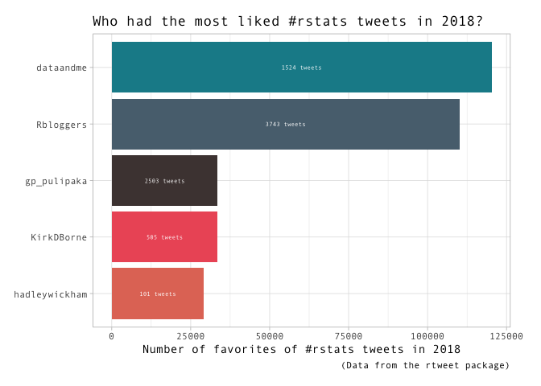
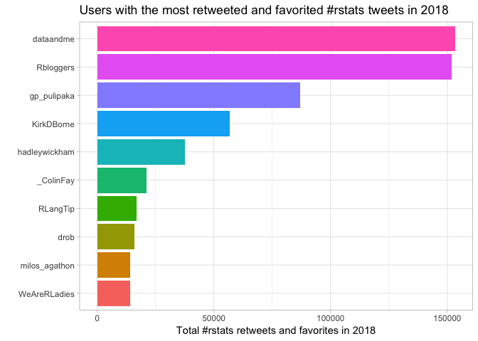
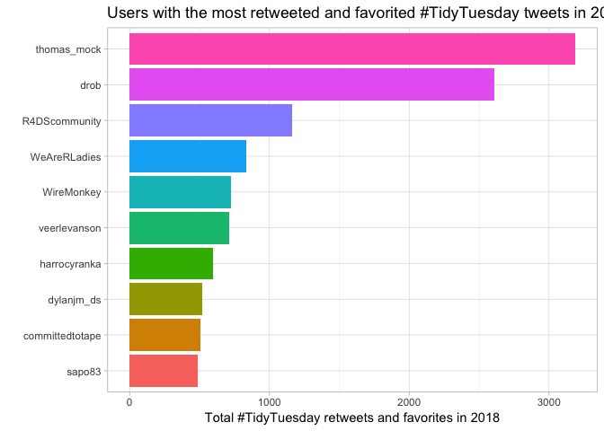
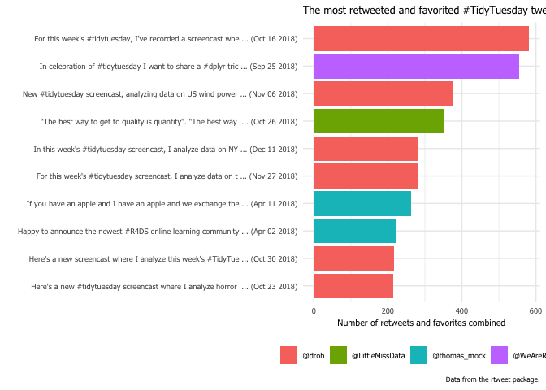
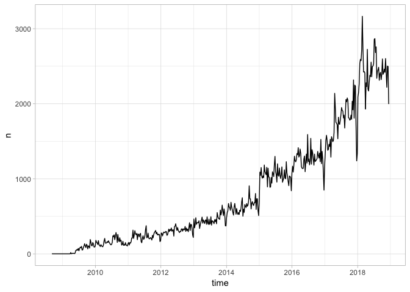
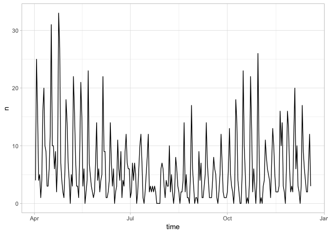
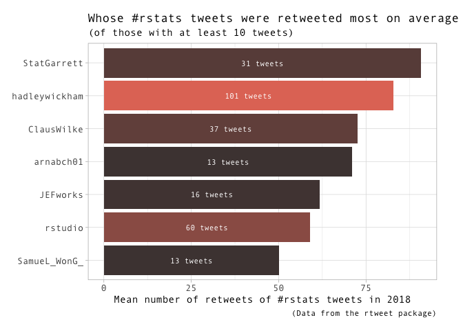
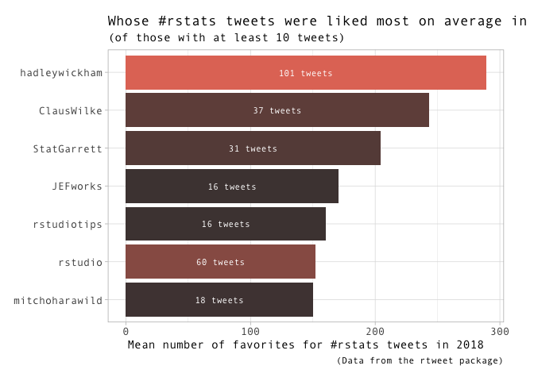

### \#First \#TidyTuesday of 2019

This is the code behind an analysis of the "\#rstats and \#TidyTuesday Tweets from rtweet" dataset from the [\#tidytuesday project](https://github.com/rfordatascience/tidytuesday/tree/master/data/2019/2019-01-01).

Whose \#rstats tweets were retweeted the most in 2018?

Whose \#rstats tweets were liked the most in 2018?

Who had the most liked and retweeted \#rstats tweets of 2018?

Who had the most liked and retweeted \#tidytuesday tweets of 2018?

What were the most retweeted and favorited \#tidytuesday tweets of 2018?

How have the number of tweets changed over time?

Whose \#rstats tweets were retweeted the most in 2018 on average?

Whose \#rstats tweets were liked the most in 2018?

