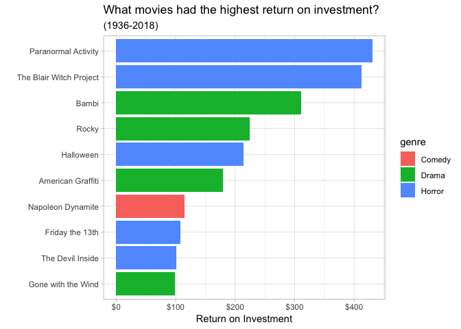
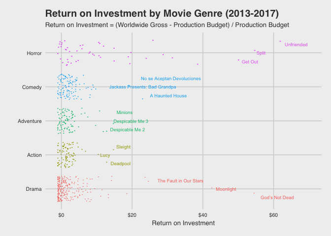

This is the code behind an analysis of the 538 "Horror Movies and Profit" dataset from the [#tidytuesday project](https://github.com/rfordatascience/tidytuesday/tree/master/data/2018-10-23).

## What movie categories have the highest return-on-investment?

<!-- -->

## How many movies at least broke even?

<!-- -->

## What is the ROI for each movie genre of movies released from 2013 to 2017?

<!-- -->

## Appendix

